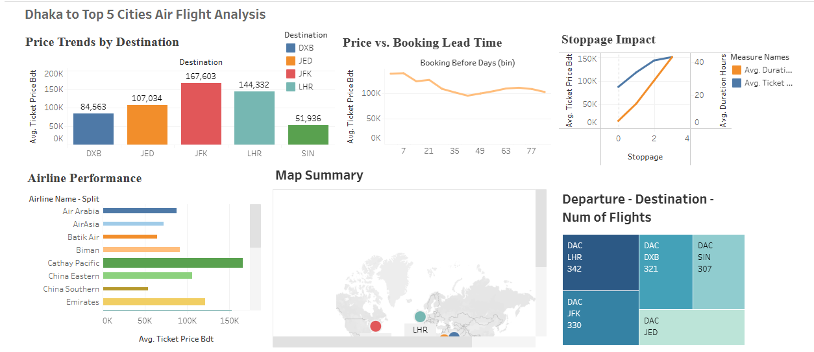

# Flight Data Scraping: Analysis and Visualizations in Tableau

## Problem Statement
In this project, I used Selenium to scrape flight data from **Google Flights**, collecting details for flights from Dhaka to five major airports ("JFK", "LHR", "DXB", "JED", "SIN") 
over the next three months. The dataset includes fields like travel date, airline, duration, stoppage, and ticket price. After cleaning the data in pandas, I analyzed pricing trends, booking
lead times, airline performance, and stoppage impact. Finally, I visualized key insights in a Tableau dashboard, including price trends, a booking strategy guide, and a map of destinations.

## Data Source
[Google Flights](https://www.google.com/travel/flights)

## Project Details

#### Introduction
The task of the project is I have to scrape a dynamic website with Selenium and build meaningful analytics and visualizations in a Tableau dashboard. To scrape data, I've selected a 
dynamic website named Google Flights. Google Flights is a flight search and booking aggregator website. It is a travel metasearch engine that allows users to search for flights, 
compare prices, and find travel deals across various airlines and booking platforms.

#### Data Scraping Process
To make data collection meaningful, I scheduled flights from Dhaka to 5 major airports. I want to collect the next 3 months of data. I selected the data column named 
["scrape_date," "departure_from," "destination," "travel_date," "airline_name," "duration," "stoppage," "ticket_price_BDT"]. After running the script, I'm able to collect the data 
in a CSV file. I have 1,599 rows without any null values.

#### Data Cleaning
For data cleaning, I load the dataset in a pandas DataFrame. Convert columns to datetime, which needed that. Calculate the difference in travel_date and scrape_date; make an extra column 
named booking_before_days. In the stoppage column, replace 'Nonstop' with 0 and extract the numeric part. After cleaning, save the DataFrame to a CSV file named 'flight_data_processed.'


## [Dashboard Preview](https://public.tableau.com/app/profile/sadidul.kabir/viz/AirFlightAnalysis/Dashboard1)




## Key Insights

**Price Trends by Destination:** Here, I want to show avg. ticket price for each destination.
**Price vs. Booking Lead Time:** How prices change based on lead time. Best time to book flights for lowest fares.
**Stoppage Impact:**
   1.	When to choose non-stop flights: Business travel, time-sensitive trips.
   2.	When stopovers make sense: Budget travelers, flexible schedules.
   3.	Best strategies: Balancing price and travel comfort.
**Airlines Performance:** Is the airline budget-friendly or premium?
**Map Summary:** Want to show the destination point in a map.

## Build From Source
1. Clone repo
```bash
git clone https://github.com/sadidul/scrape_flight_data.git
```
2. Initialize virtual environment
```bash
virtualenv venv  
```
3. Activate virtual environment
```bash
source ./venv/bin/activate
```
4. Install dependencies
```bash
pip install -r requirements.txt
```
5. First run ``scrape_flight_data.py`` file for scraping data
6. From data folder ``flights_data_scrape.csv`` is the original scraping data set. 
8. Then running ``flights_data_cleaning.ipynb`` file you'll get the the processed data.
   Which is stored in data folder called ``flights_data_processed.csv``.


## 📜 License
This project is licensed under the **MIT License** – see the [LICENSE](LICENSE) file for details.

## 🛠️ Contributions
We welcome contributions! Feel free to fork the repository and submit a pull request.

## 📩 Contact
For any inquiries or collaborations:
- **GitHub:** [github.com/sadidul](https://github.com/sadidul)
- **LinkedIn:** [linkedin.com/in/md-sadidul-kabir](https://www.linkedin.com/in/md-sadidul-kabir/)
- **Email:** msk.chanchal@gmail.com

🚀 **Star this repo** ⭐ if you find it useful!
